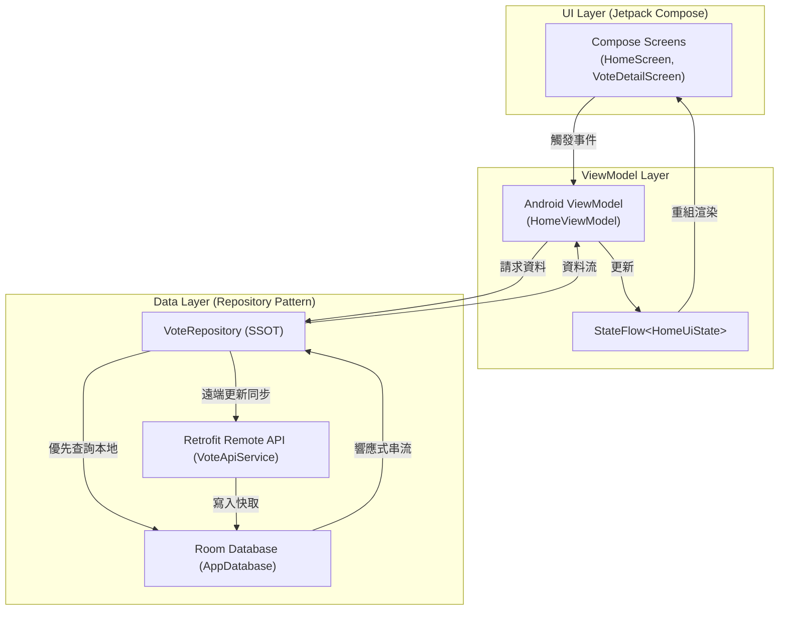

# FunnyVote 趣投票 🗳️ (Kotlin & Compose 現代化首發版)

<p align="center">
  <a href="https://kotlinlang.org/"></a>
  <a href="https://developer.android.com/jetpack/compose"></a>
  <a href="https://developer.android.com/topic/libraries/architecture/viewmodel"></a>
  <a href="https://developer.android.com/training/data-storage/room"></a>
  <a href="https://dagger.dev/hilt/"></a>
  <a href="https://opensource.org/licenses/MIT"></a>
</p>

---

## 📖 基本資料 (Basic Info)

* **專案定位**：從舊版 Java 跨越至現代 Kotlin 技術棧的首發重構專案。
* **分支角色 (`kotlin-rewrite`)**：**語言與 UI 宣告式現代化里程碑分支**。將 2016 時代的 Java 7/8、肥大 XML 佈局與命令式 View 樹，全盤重塑為簡潔、型別安全且高度可讀的現代代碼庫。
* **核心解決痛點**：
  * **Null 安全性與樣板代碼**：透過 Kotlin 空安全系統消除 `NullPointerException`，以 Data Class 減少 70% Java POJO 樣板。
  * **宣告式取代 XML**：徹底淘汰 `setContentView()`、`findViewById()` 與 ButterKnife，啟用 Jetpack Compose 聲明式元件。
  * **異步回呼解耦**：使用 `Kotlin Coroutines` 與 `Flow` 徹底終結 Retrofit 舊版多層 Callback Hell。
  * **架構分層規範**：從昔日 Activity 包辦一切的肥大代碼，轉移為具備標準生命週期管理的 MVVM 架構。

---

## 🚀 技術亮點與規格矩陣 (Technical Highlights)

| 組件層級 | 採納技術 / 規格 | 詳細設計與優勢 |
| :--- | :--- | :--- |
| **開發語言** | Kotlin 2.0.21 | 啟用空安全、擴充函數 (Extension Functions) 與標準庫高階函數 |
| **UI 宣告層** | Jetpack Compose (Material 3) | 聲明式單元組合，搭配 Navigation Compose 管理跨頁面路由 |
| **架構模式** | MVVM + StateFlow | `ViewModel` 封裝業務資料，透過響應式 `StateFlow` 對外暴露狀態 |
| **本地快取** | AndroidX Room 2.6.1 | 淘汰舊版 GreenDAO / ActiveAndroid，支援安全編譯期 SQL 語法驗證 |
| **網路通訊** | Retrofit 2.9.0 + Coroutines | 原生支援掛起函數 (`suspend fun`)，免除執行緒切換維護心智負擔 |
| **依賴注入** | Google Hilt 2.51.1 | 簡化依賴關係，為資料來源與 ViewModel 提供標準生命週期範圍注入 |

---

## 🏗️ 系統架構與設計模式 (Architecture & Design Patterns)

本分支實作標準的 **MVVM (Model-View-ViewModel)** 架構：



---

## 🌿 各分支演進地圖 (Branch Evolutionary Roadmap)

```text
[main] ───────────────► 2016 經典 Java / ButterKnife / EventBus / SQLite
   │
   ├─► [kotlin-rewrite] (★ Current)
   │                       └─► 語法現代化：Java 轉 Kotlin、引進 Coroutines 與基礎 Compose、
   │                           確立 MVVM + Room + Hilt 現代工程基礎
   │
   ├─► [mvi-rewrite] ────► 架構規範化：探索嚴格 MVI 單向資料流 (UDF) 基礎
   │
   ├─► [modern-android] ─► 全面現代化：Compose 100% 畫面補全、Room 本地快取、Hilt 注入
   │
   └─► [feature/firebase-backend]
                           └─► 雲原生躍遷：Firebase Serverless、Cloud Firestore、
                               離線持久化、實體 Android 16 真機驗收
```

---

## 📦 快速上手與運行指引 (How to Build & Run)

```bash
# 1. 進入 Android 專案目錄
cd funnyvote

# 2. 執行單元測試
./gradlew testDebugUnitTest

# 3. 編譯 Debug APK
./gradlew assembleDebug
```
