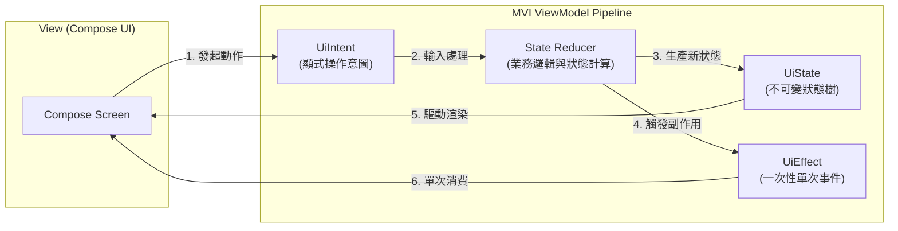

# FunnyVote 趣投票 🗳️ (MVI 單向資料流重構版)

<p align="center">
  <a href="https://kotlinlang.org/"></a>
  <a href="https://developer.android.com/jetpack/compose"></a>
  <a href="https://developer.android.com/jetpack/compose"></a>
  <a href="https://developer.android.com/training/data-storage/room"></a>
  <a href="https://dagger.dev/hilt/"></a>
  <a href="https://opensource.org/licenses/MIT"></a>
</p>

---

## 📖 基本資料 (Basic Info)

* **專案定位**：MVI (Model-View-Intent) 單向資料流最佳實踐探索專案。
* **分支角色 (`mvi-rewrite`)**：架構規範化演進分支。旨在跳過傳統 MVVM 狀態零散的缺陷，奠定全專案嚴格**單向資料流 (Unidirectional Data Flow, UDF)** 與**不可變狀態容器 (Immutable State Container)** 的架構基石。
* **核心解決痛點**：
  * **狀態混亂與多重真理**：解決傳統 MVVM 中多個 `MutableLiveData` / `StateFlow` 相互依賴導致的狀態撕裂。
  * **副作用 (Side-effects) 洩漏**：將一次性事件（如彈出 Toast、SnackBar、頁面導航）與持久狀態嚴格解耦為 `UiEffect`。
  * **意圖顯式化 (Explicit Intent)**：使用者所有操作均抽象為強型別 `UiIntent`，徹底提高代碼可測試性與可追蹤性。

---

## 🚀 技術亮點與規格矩陣 (Technical Highlights)

| 組件層級 | 採納技術 / 規格 | 詳細設計與優勢 |
| :--- | :--- | :--- |
| **核心架構** | MVI (Model-View-Intent) | 實作 `BaseViewModel<State, Intent, Effect>`，統一生態管線與狀態流轉 |
| **狀態管理** | `StateFlow<UiState>` | 單一不可變狀態樹，杜絕外部直接篡改，天然親和 Compose Recomposition |
| **副作用處理** | `Channel<UiEffect>` / `SharedFlow` | 熱串流緩衝一次性副作用事件，保證旋轉螢幕與配置變更不重複消費 |
| **UI 宣告層** | Jetpack Compose (Material 3) | 響應式觀察 `UiState`，將使用者互動無縫映射為 `sendIntent(intent)` |
| **資料持久化** | Room Database | SQLite 本地快取層，提供 Repository 單一事實來源 (SSOT) |
| **非同步並發** | Kotlin Coroutines | 結構化並發控制，藉由 `viewModelScope` 確保協程生命週期自動銷毀 |

---

## 🏗️ 系統架構與設計模式 (Architecture & Design Patterns)

MVI 透過閉環單向資料流，杜絕任何雙向綁定與暗度陳倉的狀態修改：



### MVI 三大核心要素實作範例
```kotlin
// 1. 不可變畫面狀態 (Single Source of Truth)
data class HomeUiState(
    val isLoading: Boolean = false,
    val hotVotes: List<VoteData> = emptyList(),
    val errorMessage: String? = null
) : UiState

// 2. 顯式使用者意圖 (Explicit User Intents)
sealed interface HomeUiIntent : UiIntent {
    object Refresh : HomeUiIntent
    data class ToggleFavorite(val voteId: String) : HomeUiIntent
}

// 3. 一次性副作用 (Single-shot Side-effects)
sealed interface HomeUiEffect : UiEffect {
    data class ShowToast(val message: String) : HomeUiEffect
    data class NavigateToDetail(val voteId: String) : HomeUiEffect
}
```

---

## 💡 當年時空背景與工程師決策復盤 (Retrospective)

### 為什麼選擇跳過傳統 MVVM，直上 MVI？
在 Jetpack Compose 全面普及後，聲明式 UI 的核心哲學是 `UI = f(State)`。然而傳統 MVVM 中，ViewModel 往往暴露出多個分散的狀態流（如 `isLoading`, `voteList`, `errorMsg`）。在非同步網路抖動或並發寫入時，極易出現「進度條在轉、錯誤訊息顯示、但列表卻有資料」的「狀態撕裂 (State Tearing)」怪異現象。

### MVI (UDF) 帶來的工程革新：
1. **單一事實來源 (Single Source of Truth)**：畫面在任何瞬間都由唯一的不可變 `UiState` 決定，杜絕狀態矛盾。
2. **操作意圖顯式化 (Explicit Intent)**：所有的 UI 觸發動作（點擊投票、下拉刷新、切換 Tab）都必須包裝成強型別的 `UiIntent`，除錯時只需印出 Intent 即可精確重現所有行為軌跡。
3. **副作用乾淨分離 (Side-effects Isolation)**：導航切頁、跳 Toast 等一次性動作走獨立的 `UiEffect (Channel)`，徹底杜絕螢幕旋轉導致 Toast 重複彈出的歷史沉痾。

### 當年留下的工程代價：
- **樣板代碼略有上升**：每次新增一個微小互動，都必須在 `UiIntent` 定義密封介面，對極端簡單的靜態頁面略顯繁瑣。但換來的可測試性與狀態確定性遠超代價。

---

## 🌿 各分支演進地圖 (Branch Evolutionary Roadmap)

```text
[main] ───────────────► 2016 經典 Java / ButterKnife / EventBus / SQLite
   │
   ├─► [mvp] ──────────► 2017 初次解耦：導入 Google MVP Blueprint、Contract 契約設計
   │
   ├─► [mvp_rxjava] ────► 2017 響應式進化：引入 RxJava 切換執行緒、統一數據串流管線
   │
   ├─► [mvp_dagger] ────► 2017 依賴注入：引入 Dagger 2，實現編譯期依賴拓撲圖
   │
   ├─► [mvp_kotlin] ────► 2018 初探 Kotlin：Java 全盤轉 Kotlin 1.2、消滅 NPE
   │
   ├─► [kotlin-rewrite] ──► 2024 現代轉型：Kotlin 2.0 + Coroutines + 基礎 Compose
   │
   ├─► [mvi-rewrite] (★ Current)
   │                       └─► 2024 架構規範：建立嚴格 MVI 單向資料流 (UDF)、
   │                           定義 UiState / UiIntent / UiEffect 核心管線
   │
   ├─► [modern-android] ─► 2026 現代完備：Compose 100% 畫面補全、Room 快取、Hilt 注入
   │
   └─► [feature/firebase-backend]
                           └─► 2026 雲原生旗艦版：Firebase Serverless、Cloud Firestore、
                               離線持久化、實體 Android 16 真機驗收
```

---

## 📦 快速上手與運行指引 (How to Build & Run)

```bash
# 1. 進入 Android 專案目錄
cd funnyvote

# 2. 執行單元測試
./gradlew testDebugUnitTest

# 3. 編譯 Debug APK
./gradlew assembleDebug
```
