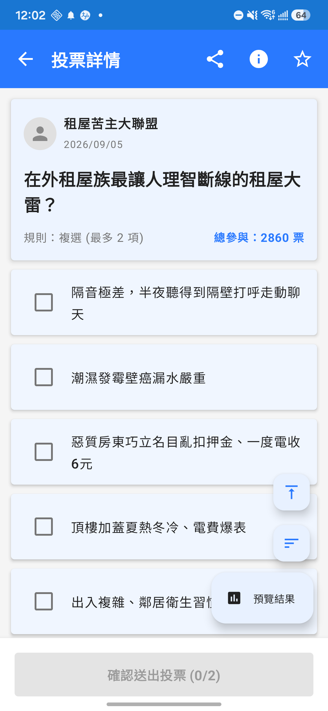
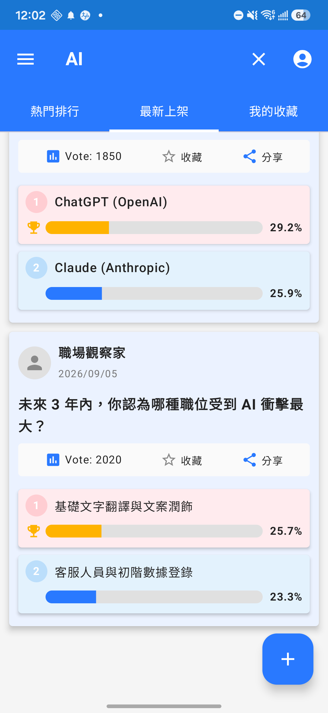

# FunnyVote 趣投票 🗳️ (Firebase Serverless 雲原生旗艦版)

<p align="center">
  
</p>

<p align="center">
  <a href="https://kotlinlang.org/"></a>
  <a href="https://developer.android.com/jetpack/compose"></a>
  <a href="https://firebase.google.com/"></a>
  <a href="https://firebase.google.com/docs/firestore"></a>
  <a href="https://dagger.dev/hilt/"></a>
  <a href="https://opensource.org/licenses/MIT"></a>
</p>

---

## 📖 基本資料 (Basic Info)

* **專案定位**：現代化分散式雲原生投票平台 (Modern Cloud-Native Serverless Polling Platform)。
* **分支角色 (`feature/firebase-backend`)**：全專案的**旗艦演進分支**。全面捨棄傳統自建後端與舊版 REST API，全盤遷移至 Google Firebase 雲原生架構。
* **核心解決痛點**：
  * **零運維與高可用**：以 Cloud Firestore + Authentication + Storage 取代傳統 VPS 運維與 SQL 維護成本。
  * **真即時資料同步 (Real-time Sync)**：基於 Firestore `SnapshotFlow` 實現毫秒級投票得票率、選項變更與熱門排行即時推播。
  * **極致離線可用性 (Offline Persistence)**：採用 Firestore 現代持久化快取（Persistent Cache），無網環境依然可秒級讀寫與本機排隊同步。
  * **效能與查詢成本極小化**：透過反正規化 `topOptions` 與 Bi-gram 切詞索引，徹底消除 Subcollection N+1 查詢與模糊搜尋痛點。

---

## 🚀 技術亮點與規格矩陣 (Technical Highlights)

| 組件層級 | 採納技術 / 規格 | 詳細設計與優勢 |
| :--- | :--- | :--- |
| **程式語言** | Kotlin 2.0.21 | 搭配 Coroutines 結構化並發與 Flow 非同步響應串流 |
| **UI 框架** | Jetpack Compose (Material 3) | 100% 宣告式 UI，支援動態色彩、平滑滾動動畫與深色模式 |
| **架構模式** | MVI (Model-View-Intent) | 嚴格單向資料流 (UDF)：`UiState`、`UiIntent`、`UiEffect` 職責分明 |
| **雲端後端** | Firebase Cloud Firestore | 原生模式 (Native Mode, `asia-east1`)，具備雲端安全規則與複合索引 |
| **身分認證** | Firebase Authentication | 支援免密碼匿名訪客登入 (Anonymous Auth)，無縫綁定雲端資料 |
| **本地快取** | Firestore Persistent Cache | 捨棄 Room 雙快取過度設計，以 Firestore 本地持久化維持 Single Source of Truth |
| **模糊檢索** | Bi-gram / N-gram 索引陣列 | 雲端文檔自動切詞，透過 `array-contains` 索引實現全文模糊匹配 |
| **並發安全** | Firestore 原子 Transaction | 一人一票純寫入校驗，杜絕高並發重複刷票與計數溢出 |

---

## 🏗️ 系統架構與設計模式 (Architecture & Design Patterns)

本分支採用 **MVI (Model-View-Intent)** 結合 **Serverless Client-First** 架構：

```mermaid
flowchart TD
    subgraph UI_Layer ["UI Layer (Jetpack Compose)"]
        Screen["Compose Screens\n(HomeScreen / VoteDetailScreen)"]
        UserAction["User Gestures\n(Tap, Swipe, Vote, Search)"]
    end

    subgraph MVI_Core ["MVI Presentation Layer"]
        ViewModel["MVI ViewModel\n(HomeViewModel / VoteDetailViewModel)"]
        Intent["UiIntent (單向輸入)"]
        State["UiState (StateFlow)"]
        Effect["UiEffect (SharedFlow 一次性副作用)"]
    end

    subgraph Data_Layer ["Data & Repository Layer"]
        Repo["VoteRepository (SSOT 協調者)"]
        FirestoreDS["FirestoreVoteDataSource"]
        AuthDS["FirebaseAuthDataSource"]
    end

    subgraph Firebase_Cloud ["Firebase Cloud Infrastructure (funny-vote-2e6be)"]
        Firestore["Cloud Firestore (asia-east1)\n• Collections: polls, promotions, users\n• Subcollections: options, voters, favorites"]
        Auth["Firebase Auth (Anonymous / Social)"]
        Storage["Cloud Storage (Poll & User Images)"]
    end

    UserAction -->|發送| Intent
    Intent -->|接收處理| ViewModel
    ViewModel -->|調用| Repo
    Repo -->|讀寫| FirestoreDS
    Repo -->|認證身分| AuthDS

    FirestoreDS <-->|持久化快取 / 即時 SnapshotFlow| Firestore
    AuthDS <-->|Token 授權| Auth

    FirestoreDS -->|Data Flow| Repo
    Repo -->|Domain Models| ViewModel
    ViewModel -->|更新狀態| State
    ViewModel -->|單次事件 (SnackBar/導航)| Effect
    State -->|宣告式重組 (Recomposition)| Screen
    Effect -->|觸發| Screen
```

### 關鍵架構決策 (Key Architectural Trade-offs)
1. **捨棄 Room + Firestore 雙快取**：Firestore 本身具備完整離線持久化能力（`persistentCacheSettings`），直接以 Firestore 本地快取作為唯一資料來源，消除 800+ 行 DAO/Entity 轉換與一致性同步撕裂。
2. **反正規化快取 `topOptions`**：在 `polls/{pollId}` 主文檔嵌入得票最高之前兩大選項，首頁列表渲染無需向選項子集合發起 N+1 次查詢，讀取成本驟降 90%。
3. **雲端 Bi-gram 分詞搜尋**：標題入庫時切分單字與雙字元詞彙，利用 `security == '00' && searchKeywords array-contains query` 複合索引達成毫秒級搜尋。

---

## 📁 專案模組與目錄結構 (Project Structure)

```text
funnyvote/
├── app/src/main/java/com/heaton/funnyvote/
│   ├── MainActivity.kt                     # 單一 Activity 入口
│   ├── FunnyVoteApplication.kt             # Hilt 應用程式實體與 Firebase 初始化
│   ├── data/
│   │   ├── model/                          # 核心領域模型 (VoteData, VoteOption, Promotion)
│   │   ├── remote/firebase/                # Firebase 雲端資料來源
│   │   │   ├── FirestoreVoteDataSource.kt  # 響應式即時查詢、Transaction 投票、分詞檢索
│   │   │   └── FirebaseAuthDataSource.kt   # 匿名身分認證與使用者資料夾
│   │   └── repository/
│   │       └── VoteRepository.kt           # 統一對外儲存庫 (SSOT)
│   ├── di/                                 # Hilt 依賴注入模組 (FirebaseModule, RepositoryModule)
│   └── ui/
│       ├── base/                           # MVI 基礎架構 (MviViewModel, UiState, UiIntent)
│       ├── navigation/                     # Navigation Compose 路由定義
│       ├── theme/                          # Material 3 主題、字體與調色盤
│       └── screens/                        # 現代 Compose 畫面
│           ├── home/                       # 首頁、焦點輪播橫幅、熱門/最新/收藏 Tab
│           ├── detail/                     # 投票詳情、即時進度條、動態子選項加載
│           ├── create/                     # 發起投票 (雙 Tab 內容與規則配置)
│           ├── profile/                    # 個人中心與暱稱修改
│           ├── about/                      # 關於頁面與四大子模組 (App, 作者, 授權, FAQ)
│           └── welcome/                    # 啟動頁與平滑過渡動畫
└── app/src/test/                           # 12 項單元測試 (Home, Detail, Create ViewModel)
```

---

## 🌿 各分支演進地圖 (Branch Evolutionary Roadmap)

FunnyVote 記錄了 Android 開發十年來的重大架構演進：

```text
[main] ───────────────► 2016 經典 Java / ButterKnife / EventBus / SQLite
   │
   ├─► [kotlin-rewrite] ──► 語法現代化：Java 轉 Kotlin、引進 Coroutines 與基礎 Compose
   │
   ├─► [mvi-rewrite] ────► 架構規範化：探索嚴格 MVI 單向資料流 (UDF) 基礎
   │
   ├─► [modern-android] ─► 全面現代化：Compose 100% 畫面補全、Room 本地快取、Hilt 注入
   │
   └─► [feature/firebase-backend] (★ Current)
                           └─► 雲原生躍遷：Firebase Serverless、Cloud Firestore、
                               離線持久化、實體 Android 16 真機驗收
```

---

## 📦 快速上手與運行指引 (How to Build & Run)

### 1. 環境需求
* **Android Studio**：Ladybug (2024.2+) 或更高版本。
* **JDK**：OpenJDK 18 (或相容 Java 17+)。
* **測試裝置**：Android 8.0 (API 26) ~ Android 16 (API 36)。

### 2. 編譯與測試指令
```bash
# 1. 進入 Android 專案目錄
cd funnyvote

# 2. 執行單元測試 (12 項 ViewModel 狀態測試)
./gradlew testDebugUnitTest

# 3. 編譯 Debug APK
./gradlew assembleDebug

# 4. 安裝至連線之實體機或模擬器
adb install -r app/build/outputs/apk/debug/app-debug.apk
```

> **注意**：本分支已內建連線至官方演示資料庫 `funny-vote-2e6be` 之 `google-services.json`。若需部署至您專屬的 Firebase 專案，請參考後端倉庫說明。

---

## 📸 實機畫面展示 (Live Verification)

> 以下畫面截圖自實體機 **Samsung Galaxy S23 (Android 16)** 實地運行驗收：

| 首頁熱門排行與焦點輪播 | 實機滑動瀏覽熱門話題 |
| :---: | :---: |
|  |  |
| **投票詳情與動態子選項加載** | **即時分詞檢索 (搜尋「AI」話題)** |
|  |  |

---

## 🔗 相關專案與後端庫
* **後端獨立倉庫**：[boochlin06/funnyvote-backend](https://github.com/boochlin06/funnyvote-backend)（包含 Firestore 安全規則、複合索引與 50 筆熱門種子腳本）
* **重構故事復盤**：[《寫給十年前寫 Java 的自己：用 Claude 與 Gemini 重構 FunnyVote 的 48 小時奇幻旅程》](docs/10_YEARS_REFACTORING_FUNNYVOTE_BLOG.md)
* **設計規格書**：[Firebase 後端規格與遷移藍圖](docs/FIREBASE_BACKEND_DESIGN.md)
