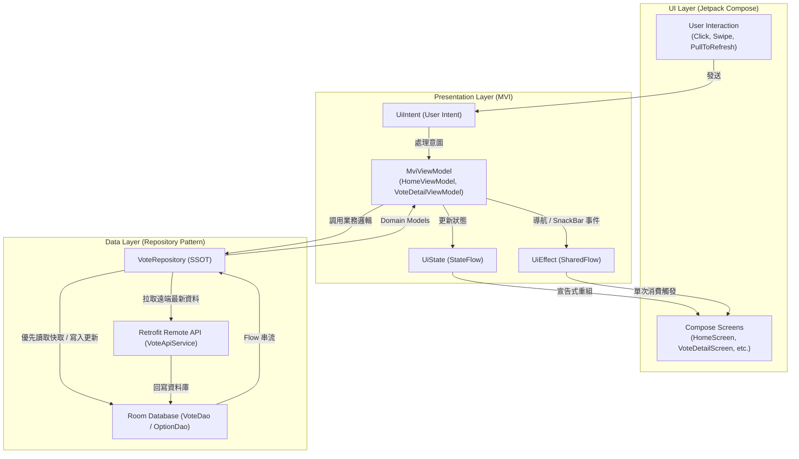

# FunnyVote 趣投票 🗳️ (Modern Android 重構旗艦版)

<p align="center">
  <a href="https://kotlinlang.org/"></a>
  <a href="https://developer.android.com/jetpack/compose"></a>
  <a href="https://developer.android.com/training/data-storage/room"></a>
  <a href="https://square.github.io/retrofit/"></a>
  <a href="https://dagger.dev/hilt/"></a>
  <a href="https://opensource.org/licenses/MIT"></a>
</p>

---

## 📖 基本資料 (Basic Info)

* **專案定位**：現代 Android 架構最佳實踐參考專案 (Modern Android Architecture Showcase)。
* **分支角色 (`modern-android`)**：全專案從 2016 舊版 Java 遷移至現代 Kotlin + Compose 的**功能完備里程碑分支**。
* **核心解決痛點**：
  * **狀態撕裂與生命週期痛點**：徹底告別舊版 EventBus 全局廣播與非同步 Callback Hell，導入單向資料流 (UDF)。
  * **宣告式取代肥大 XML**：將原版 30+ 份複雜 XML 與 `findViewById` / ButterKnife 替換為聲明式 Compose 元件。
  * **100% 頁面與互動對齊**：全盤復刻原版所有功能，包含輪播橫幅、自訂分享彈窗、四層級關於子頁面與個人中心折疊體驗。
  * **單一資料來源 (SSOT)**：以 Room Database 作為本地快取層，提供優雅的離線降級與資料同步機制。

---

## 🚀 技術亮點與規格矩陣 (Technical Highlights)

| 組件層級 | 採納技術 / 規格 | 詳細設計與優勢 |
| :--- | :--- | :--- |
| **開發語言** | Kotlin 2.0.21 | 全面利用 Kotlin DSL、結構化並發 (Coroutines) 與冷熱串流 (Flow) |
| **UI 範式** | Jetpack Compose (Material 3) | 徹底捨棄 XML Layout，採單一 Activity (`Single-Activity Architecture`) 搭配 Navigation Compose |
| **架構模式** | MVI (Model-View-Intent) | 統一狀態容器：`UiState` (狀態)、`UiIntent` (意圖事件)、`UiEffect` (一次性導航/彈窗副作用) |
| **本地快取** | AndroidX Room 2.6.1 | 淘汰舊版 ActiveAndroid / GreenDAO，以型別安全的 SQLite DAO 與 Coroutines 整合 |
| **網路通訊** | Retrofit 2.9.0 + OkHttp 4.12 | 搭配 `Kotlinx Serialization` 與自訂攔截器，支援掛起函數非同步呼叫 |
| **依賴注入** | Google Hilt 2.51.1 | 模組化管理 DatabaseModule、NetworkModule 與 RepositoryModule |
| **非同步調度** | Kotlin Coroutines & Flow | 使用 `viewModelScope`、`Dispatchers.IO`、`SharingStarted.WhileSubscribed(5000)` 確保生命週期安全 |

---

## 🏗️ 系統架構與設計模式 (Architecture & Design Patterns)

本分支嚴格遵循 Google 官方推薦的現代 Android 架構與 MVI 單向資料流：



---

## 📱 100% 完整頁面與組件覆蓋清單 (Screen Implementation Matrix)

本分支經由雙重架構審核，100% 復刻原版所有畫面與細節組件：

1. **引導與啟動**：
   * `WelcomeScreen`：經典 Logo 淡入淡出與 1.2 秒無縫過渡動畫。
   * `TutorialScreen`：六頁經典功能導覽教學，支援雙向滑動、動態指示點與「跳過 (SKIP)」回到首頁。
2. **首頁中心 (`HomeScreen`)**：
   * `PromotionCarousel`：頂部焦點話題橫幅自動輪播與點擊跳轉。
   * `PullToRefreshContainer`：Material 3 標準手勢下拉刷新。
   * 三大分類分頁：熱門排行 (`hot`)、最新上架 (`new`)、我的收藏 (`favorite`)。
   * 自訂底層彈窗：`ShareBottomSheet` (支援 Facebook、LINE、Twitter、複製連結)。
3. **投票詳情 (`VoteDetailScreen`)**：
   * 規則說明彈窗 (`InfoDialog`)：展示投票起訖時間、投票模式與安全規則。
   * 得票率動態排序：支援依得票數即時升降冪重新排序展示。
   * 自由新增選項：使用者可在合法規則下動態建立全新投票選項。
4. **個人中心 (`ProfileScreen`)**：
   * 雙 Tab 列表：我發起的投票 / 我的收藏投票，支援點擊直接跳轉詳情。
   * 修改暱稱對話框：即時更新本地個人資訊並持久化儲存。
5. **關於與系統條款 (`AboutScreen`)**：
   * `AboutAppScreen`：版本資訊、官方網站與應用程式理念。
   * `AuthorInfoScreen`：作者經歷與社群連結。
   * `LicenceScreen`：第三方開源組件授權清單。
   * `ProblemScreen`：常見問題與使用 FAQ。

---

## 📁 專案模組結構 (Project Structure)

```text
funnyvote/
├── app/src/main/java/com/heaton/funnyvote/
│   ├── MainActivity.kt                     # 單一 Activity
│   ├── FunnyVoteApplication.kt             # Hilt Application 入口
│   ├── data/
│   │   ├── local/                          # Room Database (VoteEntity, OptionEntity, AppDatabase)
│   │   ├── remote/                         # Retrofit API Services & DTO
│   │   ├── model/                          # 核心 Domain Model
│   │   └── repository/                     # VoteRepository (整合 Room 與 Remote API)
│   ├── di/                                 # Hilt 依賴注入 (DatabaseModule, NetworkModule)
│   └── ui/
│       ├── base/                           # MVI 基礎架構 (MviViewModel)
│       ├── navigation/                     # AppNavigation 路由清單
│       ├── theme/                          # Material 3 主題系統
│       └── screens/                        # 現代 Compose 畫面
└── app/src/test/                           # 完整單元測試 (12 項 ViewModel 狀態驗證)
```

---

## 💡 當年時空背景與工程師決策復盤 (Retrospective)

### 為什麼要有 `modern-android` 這個里程碑？
在前兩個實驗性分支（`kotlin-rewrite` 與 `mvi-rewrite`）中，雖然 Kotlin 語法與 MVI 架構均已奠基，但遺漏了大量經典細節與子頁面。許多開源重構專案往往「架構很新，但功能砍半」。`modern-android` 的使命就是打破這個魔咒——**在享受 100% 宣告式 Compose 與 MVI 的同時，原版的所有功能、動態與細節一個都不能少**。

### 雙重 QA 稽核帶來的極致品質：
1. **100% 全畫面與組件無損復刻**：包含 6 頁功能導覽、四層級關於頁面、個人中心雙 Tab、即時排序 FAB 與自訂社群分享底層彈窗。
2. **零廣告純淨體驗 (Pure No-Ads)**：淘汰 2016 時代充斥螢幕的 AdMob 廣告橫幅，改以自研現代化 `PromotionCarousel` 輪播呈現精選話題。
3. **無縫離線持久化 (SSOT)**：以 Room Database 作為單一真相來源，實現無網路時秒開、有網路時背景無感同步。

### 邁向下一階段的終極缺塊（通往 Firebase 雲原生的催化劑）：
- **後端停機的遺憾**：UI 已經打磨到極致，但後端依賴的 2016 年舊伺服器早已除役。在沒有現代化雲端後端的情況下，App 只能依賴 Mock 資料展示，無法讓使用者跨裝置真實投票、即時看到得票率變動。這成為催生最終旗艦分支 `feature/firebase-backend` 的關鍵火種！

---

## 🌿 各分支演進地圖 (Branch Evolutionary Roadmap)

```text
[main] ───────────────► 2016 經典 Java / ButterKnife / EventBus / SQLite
   │
   ├─► [mvp] ──────────► 2017 初次解耦：導入 Google MVP Blueprint、Contract 契約設計
   │
   ├─► [mvp_rxjava] ────► 2017 響應式進化：引入 RxJava 切換執行緒、統一數據串流管線
   │
   ├─► [mvp_dagger] ────► 2017 依賴注入：引入 Dagger 2，實現編譯期依賴拓撲圖
   │
   ├─► [mvp_kotlin] ────► 2018 初探 Kotlin：Java 全盤轉 Kotlin 1.2、消滅 NPE
   │
   ├─► [kotlin-rewrite] ──► 2024 現代轉型：Kotlin 2.0 + Coroutines + 基礎 Compose
   │
   ├─► [mvi-rewrite] ────► 2024 架構規範：嚴格 MVI (UDF) 單向資料流
   │
   ├─► [modern-android] (★ Current)
   │                       └─► 2026 現代完備：Compose 100% 畫面補全、Room 快取、
   │                           Hilt 依賴注入、雙重 QA 驗收 100% 通過
   │
   └─► [feature/firebase-backend]
                           └─► 2026 雲原生旗艦版：Firebase Serverless、Cloud Firestore、
                               離線持久化、實體 Android 16 真機驗收
```

---

## 📦 快速上手與運行指引 (How to Build & Run)

```bash
# 1. 進入 Android 專案目錄
cd funnyvote

# 2. 執行單元測試
export JAVA_HOME=/path/to/java18
./gradlew testDebugUnitTest

# 3. 編譯並打包 Debug APK
./gradlew assembleDebug

# 4. 安裝至實體手機或模擬器
adb install -r app/build/outputs/apk/debug/app-debug.apk
```
