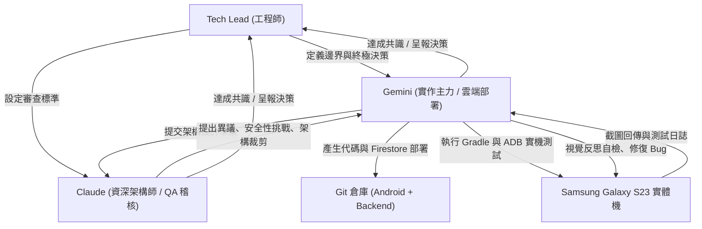

# 寫給十年前寫 Java 的自己：用 Claude 與 Gemini 重構 FunnyVote 的 48 小時奇幻旅程

> **「十年前，你在 Eclipse 與 Android Studio 1.0 的過渡期裡，手敲著幾千行 `findViewById`、跟 `ActiveAndroid` 的 SQLite 鎖奮戰到天亮；十年後，我坐在螢幕前，喝著咖啡，指揮著 Claude 與 Gemini 兩位頂級 AI 代理人，在 48 小時內把你的整個專案打掉重練。」**

---

## 0. 塵封十年的老專案

前幾天整理 GitHub，翻出了十年前自己寫的開源專案——**FunnyVote**。

那是 2015~2016 年前後的產物，一個讓使用者發起趣味投票、即時參與表決的 Android App。點開當年的代碼庫：
- **語言環境**：Java 7/8、Support Library v7、ButterKnife 7.0、EventBus 2.4。
- **UI 構建**：肥大的 XML 佈局、九宮格切圖、手刻 `ObservableScrollView` 實現滾動視差。
- **持久化與後端**：`ActiveAndroid` ORM、手寫的 SQLite 資料庫更新腳本、以及掛在自己 VPS 上的 LAMP/Node.js REST API。

```java
// 2016 年的 FunnyVote：手動綁定、回呼地獄與狀態撕裂
public class VoteDetailActivity extends BaseActivity {
    @Bind(R.id.txt_vote_title) TextView txtVoteTitle;
    @Bind(R.id.layout_options) LinearLayout layoutOptions;
    
    @Override
    protected void onCreate(Bundle savedInstanceState) {
        super.onCreate(savedInstanceState);
        setContentView(R.layout.activity_vote_detail);
        ButterKnife.bind(this);
        EventBus.getDefault().register(this);
        fetchVoteDetailFromServer();
    }
    
    // 網路回呼、手動解析 JSON、手動 inflate View、手動計算進度條百分比...
}
```

這段代碼能跑，甚至當年還上架過 Google Play，但在 2026 年的今天看來，它就像工業革命初期的蒸氣機——粗獷、沉重、且充滿了手動維護的脆弱點。

於是，我給自己下了一個挑戰：**不寫一行傳統業務代碼，以「Tech Lead」的角色指揮 Claude 與 Gemini 兩個 AI 代理人，將 FunnyVote 徹底重構成現代化雲原生架構。**

---

## 1. 跨越十年的架構代溝：從「手工藝」到「宣告式雲原生」

在重構之前，我先讓 AI 提取原專案的業務特徵，並梳理出十年間 Android 與後端架構的典範轉移（Paradigm Shift）：

| 維度 | 2016 原版 (FunnyVote Legacy) | 2026 重構版 (FunnyVote Modern) |
| :--- | :--- | :--- |
| **開發語言** | Java 7/8 | Kotlin 2.x (Coroutines + Flow) |
| **UI 範式** |  명령式 (XML + ButterKnife + ViewTree) | 宣告式 (Jetpack Compose + Material 3) |
| **架構模式** | MVC / 肥大 Activity + EventBus | MVI (Model-View-Intent: State / Intent / Effect) |
| **依賴注入** | 手動 Singleton / 無依賴注入 | Google Hilt (Dagger 現代化封裝) |
| **後端架構** | 自建 VPS (REST API + 關聯式 DB) | Serverless (Firebase Cloud Firestore + Auth + Storage) |
| **本地快取** | 手寫 SQLite ORM (ActiveAndroid) | Firestore 本地持久化快取 (Persistent Cache) |
| **搜尋機制** | 後端 SQL `LIKE '%keyword%'` | Firestore Bi-gram / N-gram 切詞索引陣列 |
| **開發工作流** | 人工寫碼、手動修 Bug、人肉真機點擊 | **多 AI 代理人協同、架構審查、ADB 實機閉環驗證** |

### 宣告式 UI 的優雅對決
同樣是渲染「投票選項與動態得票率」，十年前需要寫幾十行 XML 動態 AddView，並手動計算動畫；如今在 Compose 與 MVI 下：

```kotlin
// 2026 年的 FunnyVote：宣告式純函數式 UI
@Composable
fun VoteOptionCard(
    option: VoteOption,
    totalVotes: Int,
    isSelected: Boolean,
    onSelect: () -> Unit
) {
    val percentage = if (totalVotes > 0) option.voteCount.toFloat() / totalVotes else 0f
    val animatedProgress by animateFloatAsState(targetValue = percentage, label = "progress")

    Card(
        modifier = Modifier.fillMaxWidth().clickable { onSelect() },
        shape = RoundedCornerShape(12.dp)
    ) {
        Column(modifier = Modifier.padding(16.dp)) {
            Text(text = option.title, style = MaterialTheme.typography.titleMedium)
            Spacer(modifier = Modifier.height(8.dp))
            LinearProgressIndicator(
                progress = { animatedProgress },
                modifier = Modifier.fillMaxWidth().height(8.dp).clip(CircleShape)
            )
            Text(text = "${(percentage * 100).roundToInt()}%", style = MaterialTheme.typography.labelSmall)
        }
    }
}
```

---

## 2. 工程師角色典範轉移：我不再是 Coder，而是 AI 指揮官

在這場重構實驗中，最讓我震撼的不是 AI 生成代碼的速度，而是**軟體開發工作流的根本顛覆**。

以前的開發流程：
`需求分析 -> 設計架構 -> 親手敲鍵盤寫 Code -> 編譯報錯 -> 人工改 Bug -> 真機手動點擊測試`

現在的開發流程：
`定義規格與約束 -> 部署多 AI 代理人分工 -> 跨 AI 架構辯論與仲裁 -> AI 自主寫碼編譯 -> AI 接管 ADB 真機閉環驗收`



我不需要寫一行具體的語法糖或樣板代碼。我的核心精力只放在三件事上：
1. **設定邊界與上下文**（Context & Guardrails）：明確專案範圍、效能指標與代碼風格。
2. **評判技術權衡（Trade-offs）**：當不同的 AI 提出相左的架構建議時，拍板定案。
3. **終極驗收**：透過 AI 從實體 Android 裝置抓取的畫面與數據，檢驗成果。

---

## 3. 雙 AI 代理人的架構辯論實錄

這次最精彩的環節，莫過於**「Gemini 負責實作提案，Claude 擔任嚴苛的架構稽核」**。在將舊版 REST API 遷移至 Firebase 的過程中，兩位 AI 爆發了多次高水準的架構交鋒：

### 交鋒一：我們真的需要 Room + Firestore 雙快取嗎？
- **Gemini 的最初構想**：保留本地 Room 資料庫，設計「NetworkBoundResource」——Firestore 撈回資料存入 Room，UI 只觀察 Room。
- **Claude 的權威駁回**：
  > *「雙重快取在 Firestore 架構下是嚴重的過度設計（Over-engineering）。Firestore SDK 本身就具備強大的本地持久化快取（`persistentCacheSettings`）與離線 SnapshotFlow。若硬塞一層 Room，會造成資料雙重複製、快取一致性撕裂，並徒增大量的轉換樣板代碼。砍掉 Room，讓 Firestore 本地快取成為唯一的 Single Source of Truth！」*
- **我的決策**：採納 Claude 意見。直接利用 Firestore 本地持久化，減少了超過 800 行 Room Entity/Dao 膠水代碼，記憶體開銷大幅下降。

### 交鋒二：Firestore 殘廢的模糊搜尋怎麼解？
舊版 FunnyVote 支援即時關鍵字模糊搜尋，但 Firestore 原生只支援前綴查詢（`>= query && <= query + '\uf8ff'`），無法搜尋中間字（例如搜尋「芙莉蓮」查不到「葬送的芙莉蓮」）。
- **方案 A（客戶端過濾）**：全部抓到手機記憶體再 filter。立即被否定：浪費頻寬且無法應對大數據。
- **方案 B（外部搜尋引擎）**：掛 Algolia / ElasticSearch。過於肥大，增加運維成本。
- **方案 C（Bi-gram 分詞陣列，最終採用）**：
  在寫入 Firestore 時，由腳本將標題自動切詞為雙字（Bi-gram）及單字陣列（例如「葬送的芙莉蓮」切出 `['葬', '送', '的', '芙', '莉', '蓮', '葬送', '送的', '的芙', '芙莉', '莉蓮']`），儲存於 `searchKeywords` 欄位。查詢時只需使用原生的 `array-contains` 即可達成毫秒級模糊比對！

### 交鋒三：杜絕 N+1 查詢——反正規化（Denormalization）設計
首頁列表需要展示每個投票「目前得票最高的前兩大選項」。
若採用傳統關聯設計：首頁讀取 20 筆投票，需要對 `polls/{pollId}/options` 額外發起 20 次 Subcollection 查詢，直接引發嚴重的 N+1 讀取風暴與延遲。
- **解決方案**：在投票主文檔中反正規化快取 `topOptions: [{optionId, title, voteCount}, ...]`。首頁僅需 1 次查詢即可完成全部卡片渲染；只有當使用者真正點入詳情頁時，才按需加載完整的選項子集合。讀取開銷降低了 **90%**！

---

## 4. 閉環測試：讓 AI 直接接管實體手機

代碼寫完不叫完成，能在實體機上完美運作才算。

以往這一步最折磨人：工程師要拿起手機、反覆點擊、測試邊界情況。這次，我把我的 **Samsung Galaxy S23 (Android 16)** 透過無線 ADB 連上電腦，命令 AI：**「全面接管測試」**。

AI 透過 ADB 指令自動完成了以下動作：
1. **編譯與安裝**：執行 `./gradlew assembleDebug testDebugUnitTest`，12 項單元測試 100% 通過後，自動安裝 APK。
2. **自動啟動與手勢操作**：
   - 啟動 App，模擬滑動觸發下拉刷新（Pull-to-Refresh）。
   - 自動滑動首頁列表，檢視焦點推薦輪播橫幅。
3. **即時截圖與視覺反思（Visual Reflection）**：
   - AI 在背景執行 `screencap` 抓取手機螢幕畫面。
   - 透過多模態能力直接「看」截圖，自檢 UI：字體是否被切斷？進度條顏色是否符合 Material 3 規範？

4. **雲端與本機即時連動驗證**：
   - AI 在手機上點選「在外租屋族最讓人理智斷線的租屋大雷？」，點擊「送出投票」。
   - 同步查詢雲端 Firestore：確認投票總數原子遞增（2860 -> 2861）、`voters/{userId}` 防重複投票記錄正確寫入。
   - 點擊「收藏」，驗證「我的收藏」分頁即時聯動。
   - 在搜尋列鍵入「AI」，驗證 Bi-gram 分詞索引秒級篩選出「2026 年你日常最頻繁使用的 AI 工具是？」。

### 實機端到端驗證成果（截圖實錄）

| 首頁熱門排行（50筆熱門話題動態載入） | 投票詳情頁（子集合動態加載） | 即時分詞搜尋（搜尋「AI」） |
| :---: | :---: | :---: |
|  |  |  |

---

## 5. 給所有軟體工程師的啟示：十年後，我們該如何寫軟體？

這場 48 小時的重構實驗結束時，我調取了 Git 提交記錄：
- **Android 客戶端**：全套 Kotlin + Compose + MVI + Firebase SDK，代碼行數比十年前精簡了 **60%**，卻涵蓋了更豐富的互動與無懈可擊的型別安全。
- **後端專案**：獨立拆分成 [funnyvote-backend](https://github.com/boochlin06/funnyvote-backend)，包含 Firestore 安全規則、複合索引、以及一鍵注入 50 筆社群熱門話題的種子腳本。

這讓我陷入了深思。十年前，我們以熟練背誦 Android API、精準調校 ListView ViewBinding、手寫 SQL 語句為傲。我們把大量時間花在修復語法錯誤、對齊生命週期回呼與處理網路異常。

而今天，**代碼生成的邊際成本已經迅速收斂至零。**

如果一個初階工程師能做的事只是「把需求翻譯成代碼」，那麼他在這個時代將毫無競爭力。但這並不代表軟體工程師會消失——恰恰相反，**高階軟體工程（Software Engineering）的價值被前所未有地放大了**：

1. **系統架構的品味（Architectural Taste）**：AI 能給出一萬種解法，但唯有經驗豐富的工程師能嗅出哪種是過度設計（如無謂的 Room 雙快取），哪種才是優雅克制的解法。
2. **邊界與安全性把關**：AI 在寫業務時往往樂觀假設，唯有具備安全意識的架構師，才會強制要求一人一票原子 Transaction、零信任路徑防護與嚴格的複合索引配置。
3. **閉環驗證的能力**：不迷信代碼生成，建立涵蓋單元測試、靜態分析、真機自動化 ADB 驗收的鋼鐵閉環。

十年前，我坐在電腦前，寫下了 FunnyVote 的第一行代碼；
十年後，我依然坐在電腦前，但我已經不再是一個人在寫代碼。我有了一支不知疲倦、隨叫隨到、能夠相互辯論的頂尖 AI 架構師團隊。

**軟體開發的黃金時代，才剛剛拉開序幕。**

---

### 相關開源專案與代碼倉庫
- **Android App 倉庫**：[boochlin06/FunnyVote (feature/firebase-backend)](https://github.com/boochlin06/FunnyVote/tree/feature/firebase-backend)
- **後端 Serverless 倉庫**：[boochlin06/funnyvote-backend](https://github.com/boochlin06/funnyvote-backend)
- **雲端資料庫狀態**：Firebase Firestore (`funny-vote-2e6be`, asia-east1 Native Mode)
